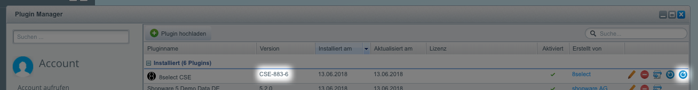

# shopware-plugin-sob

https://www.8select.com/8select-cse-installationsanleitung-shopware

&nbsp;
___
&nbsp;

## Development Workflow

### 1. Setup up a Shopware Test Environment
- Go to [Shopware Community Edition](https://de.shopware.com/community/) and get your prefered Shopware Community Edition Release (min. Version 5.2.17)
- Setup a local Webserver (Apache / Nginx with PHP 5.6+ and MySQL 5.4+) and install your Shopware Testshop - i.e. if you are on Mac OS you can use [MAMP](https://www.mamp.info/de/), if you are on Windows you can use [XAMPP](https://www.apachefriends.org/de/index.html)
- clone this repository to your local machine

### 2. Develop and Test
- Go to your local repository and write code
- run `bin/copy2dev.sh /path/to/shopware/custom/plugins/ __VERSION__`  to copy the current state of your repository to the plugins directory; prefix your version with a reference to the JIRA issue i.e. `CSE-880`
- update the plugin through Shopware's Plugin Manager
- test your changes within your local Testshop

**Note:** The `bin/copy2dev.sh` will always create a `staging` build within your destination directory so to avaoid test outputs to the `production` environment. This means product exports as well as widget integrations will use endpoints from the `staging` stack.

